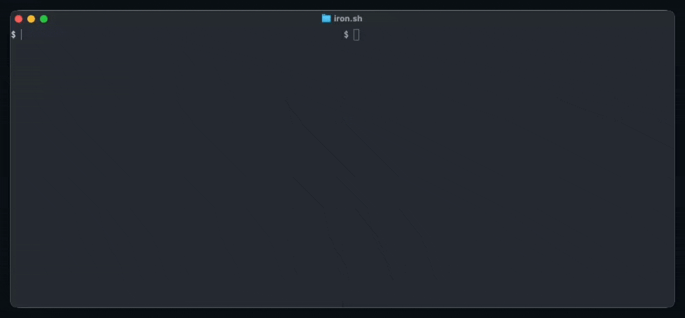

# iron-proxy

[](https://docs.iron.sh)
[](https://github.com/ironsh/iron-proxy/releases/latest)
[](https://hub.docker.com/r/ironsh/iron-proxy)

## The problem

CI jobs, AI coding agents, and sandboxed containers can make arbitrary outbound
requests. A compromised dependency, a prompt injection, or a malicious build
step can exfiltrate secrets, phone home, or open a reverse shell. Most
teams have zero visibility into what's leaving their workloads, let alone any
way to stop it.

## What iron-proxy does

iron-proxy is a MITM egress proxy with a built-in DNS server that sits between
your untrusted workload and the internet. It enforces default-deny at the
network boundary, so the workload can only reach domains you explicitly allow.
Real secrets never enter the sandbox. Workloads use proxy tokens, and
iron-proxy swaps in real credentials at egress, meaning a compromised workload
can exfiltrate a token that's worthless outside the proxy.

Single binary. Single YAML config.

- **Default-deny egress.** Every outbound request is blocked unless the
  destination matches your allowlist. List your domains and CIDRs, everything
  else gets a 403.
- **Boundary-level secret injection.** Workloads send proxy tokens; iron-proxy
  replaces them with real secrets before the request leaves. If the sandbox is
  compromised, the attacker gets tokens that are useless outside the proxy.
- **Per-request audit trail.** Every request logged as structured JSON with
  the full transform pipeline result: which secrets were swapped, which rules
  matched, what got blocked and why.
- **Streaming-aware.** WebSocket upgrades and Server-Sent Events are proxied
  natively. No special configuration for agent workloads that hold long-lived
  connections.
- **CONNECT and SOCKS5 support.** Optional tunnel listener for tools that
  natively support proxy configuration via `HTTPS_PROXY` or SOCKS5 settings.

Built for CI pipelines, GitHub Actions, AI agents (Claude Code, Cursor,
Codex), and any environment where you run code you don't fully trust.

<div align="center">
    <strong>Blocked exfiltration + secret rewriting in action:</strong>
    <br/><br/>
    <a href="https://screen.studio/share/Gq2zqtrp" target="_blank">
        
    </a>
</div>
 
## Installation
 
Docker images are available on [Docker Hub](https://hub.docker.com/r/ironsh/iron-proxy)
and pre-built binaries for Linux/macOS (amd64/arm64) are on
[GitHub Releases](https://github.com/ironsh/iron-proxy/releases).
 
Or build from source:
 
```bash
go build -o iron-proxy ./cmd/iron-proxy
```

## Quick start

```bash
cd examples/docker-compose
docker compose up
```

This starts iron-proxy and a demo client that fires five requests through the
proxy. Check the logs to see allowed, blocked, and secret-rewritten requests:

```bash
docker compose logs proxy
```

Every request produces a structured JSON audit entry:

```json
{
  "host": "httpbin.org",
  "method": "GET",
  "path": "/headers",
  "action": "allow",
  "status_code": 200,
  "duration_ms": 142,
  "request_transforms": [
    { "name": "allowlist", "action": "continue" },
    {
      "name": "secrets",
      "action": "continue",
      "annotations": { "swapped": [{ "secret": "OPENAI_API_KEY", "locations": ["header:Authorization"] }] }
    }
  ]
}
```

Rejected requests include a `rejected_by` field and log at WARN level. See
[Audit log format](#audit-log-format) for the full schema.

## Production usage

### 1. Generate a CA

iron-proxy terminates TLS by generating leaf certificates on the fly, signed by
a CA you provide. Client containers must trust this CA.

```bash
mkdir -p certs
openssl genrsa -out certs/ca.key 4096
openssl req -x509 -new -nodes \
    -key certs/ca.key \
    -sha256 -days 3650 \
    -subj "/CN=iron-proxy CA" \
    -addext "basicConstraints=critical,CA:TRUE" \
    -addext "keyUsage=critical,keyCertSign" \
    -out certs/ca.crt
```

### 2. Create a Docker network

iron-proxy needs a fixed IP so containers can point their DNS at it:

```bash
docker network create --subnet=172.20.0.0/24 iron-proxy
```

### 3. Start iron-proxy

Create an env file with your secrets (keep this out of version control):

```bash
echo "OPENAI_API_KEY=sk-real-key" > .env
```

```bash
docker run -d --name iron-proxy \
  --network iron-proxy --ip 172.20.0.2 \
  -v $(pwd)/proxy.yaml:/etc/iron-proxy/proxy.yaml:ro \
  -v $(pwd)/certs/ca.crt:/etc/iron-proxy/ca.crt:ro \
  -v $(pwd)/certs/ca.key:/etc/iron-proxy/ca.key:ro \
  --env-file .env \
  ironsh/iron-proxy:latest -config /etc/iron-proxy/proxy.yaml
```

### 4. Route containers through the proxy

The simplest approach is DNS-based routing: point the container's DNS at
iron-proxy and all hostname lookups resolve to the proxy IP, routing traffic
through it automatically:

```bash
docker run --rm \
  --network iron-proxy \
  --dns 172.20.0.2 \
  -v $(pwd)/certs/ca.crt:/certs/ca.crt:ro \
  curlimages/curl --cacert /certs/ca.crt https://httpbin.org/get
```

For stronger enforcement, layer nftables rules to block non-proxy egress, or use
TPROXY for kernel-level interception. See [Routing traffic to the
proxy](#routing-traffic-to-the-proxy) for details on each approach.

## Why iron-proxy?

|                          | iron-proxy                     | Squid                       | mitmproxy                 | Envoy                              |
| ------------------------ | ------------------------------ | --------------------------- | ------------------------- | ---------------------------------- |
| Default-deny egress      | Built-in                       | Requires complex ACL config | Requires custom scripting | Requires RBAC/filter configuration |
| Secret injection         | Built-in                       | No                          | No                        | No                                 |
| Structured audit logging | Built-in, per-transform traces | Basic access logs           | Plugin-based              | Configurable access logs           |
| Setup complexity         | Single binary + YAML           | Extensive config language   | Python scripting          | Complex YAML or control plane      |

iron-proxy is purpose-built for one job: controlling and auditing egress from
untrusted workloads. Squid can do default-deny but requires significant ACL
configuration and has no concept of secret injection. mitmproxy is a great
debugging tool but isn't designed for production enforcement. Envoy is a
general-purpose proxy that can be configured to do parts of this, but it's
far more complexity than the problem requires.

## How it works

iron-proxy runs a DNS server and an HTTP/HTTPS proxy. Point your container's DNS
at iron-proxy and all hostname lookups resolve to the proxy IP, routing traffic
through it automatically. The proxy terminates TLS (generating leaf certs on the
fly from a CA you provide), runs the request through an ordered transform
pipeline, forwards it upstream, and runs the response back through the pipeline.

```
Container → DNS lookup → iron-proxy IP → TLS termination → transforms → upstream
```

Transforms run in order. Built-in transforms:

| Transform   | What it does                                                                                                            |
| ----------- | ----------------------------------------------------------------------------------------------------------------------- |
| `allowlist` | Permits requests to matching domains/CIDRs; rejects everything else (403).                                              |
| `secrets`   | Scans headers, query params, and optionally body for proxy tokens and swaps in real secrets from environment variables. |

## Configuration

iron-proxy takes a single flag: `-config path/to/config.yaml`. Here's the
full shape (see [`iron-proxy.example.yaml`](iron-proxy.example.yaml) for a
copy-pasteable starting point):

```yaml
dns:
  listen: ":53"
  proxy_ip: "10.16.0.1" # IP where iron-proxy is running (required)
  passthrough: # Domains forwarded to OS resolver
    - "*.internal.corp"
    - "metadata.google.internal"
  records: # Static DNS records (highest precedence)
    - name: "internal.example.com"
      type: A
      value: "10.0.0.5"

proxy:
  http_listen: ":80"
  https_listen: ":443"
  tunnel_listen: ":8080" # Optional CONNECT/SOCKS5 listener
  max_request_body_bytes: 1048576 # 1 MiB (default)
  max_response_body_bytes: 0 # uncapped (default)

tls:
  ca_cert: "/etc/iron-proxy/ca.crt" # Required
  ca_key: "/etc/iron-proxy/ca.key" # Required
  cert_cache_size: 1000 # LRU cache for generated leaf certs
  leaf_cert_expiry_hours: 72

transforms:
  - name: allowlist
    config:
      domains:
        - "api.openai.com"
        - "*.anthropic.com"
      cidrs:
        - "10.0.0.0/8"

  - name: secrets
    config:
      secrets:
        - source:
            type: env
            var: OPENAI_API_KEY # Env var holding the real secret
          proxy_value: "proxy-token-123" # Token the sandbox sends
          match_headers: ["Authorization"]
          match_body: false
          require: true # Reject requests without the proxy token
          rules:
            - host: "api.openai.com"

log:
  level: "info" # debug, info, warn, error
```

### DNS

Everything resolves to `proxy_ip` by default, which is what routes traffic
through the proxy. Exceptions:

- **`passthrough`:** glob patterns forwarded to the OS resolver (e.g.,
  `*.internal.corp`). Traffic to these hosts bypasses the proxy entirely.
- **`records`:** static A or CNAME records. Highest precedence.

### Allowlist

Default-deny. Requests must match at least one domain glob or CIDR to proceed.
Unmatched requests get a `403 Forbidden`.

Domain patterns use glob matching: `*.example.com` matches any subdomain and
`example.com` itself.

**Warn mode:** Set `warn: true` to observe what the allowlist would block without
actually enforcing it. Requests that would be rejected are allowed through but
annotated with `"action": "warn"` in the transform trace. This is useful for
rolling out new allowlist rules or auditing existing traffic before switching
to enforcement.

### Annotate

Captures HTTP request headers into audit log annotations based on
host/method/path rules. This is useful for enriching audit logs with
request-specific context like request IDs without modifying the proxy core.

Each annotation group specifies rules to match and headers to capture. When a
request matches any rule in a group, the specified header values are written as
`header:<Name>` entries in the transform trace annotations. Requests that don't
match are passed through unchanged. This transform never rejects requests.

> **Warning:** Header values are emitted in plain text in the audit log. Only
> log headers that are safe to expose, such as request IDs or headers containing
> proxy secret tokens. Do not log headers that contain raw secrets.

```yaml
transforms:
  - name: annotate
    config:
      annotations:
        - rules:
            - host: "api.openai.com"
              methods: ["POST"]
              paths: ["/v1/*"]
          headers: ["x-request-id"]
        - rules:
            - host: "*.anthropic.com"
          headers: ["x-request-id"]
```

### Secrets

The sandbox never holds real credentials. Instead:

1. Configure iron-proxy with the real secret source: environment variables,
   AWS Secrets Manager, or AWS Systems Manager Parameter Store.
2. Give the sandbox a proxy token (e.g., `proxy-openai-abc123`).
3. Configure the `secrets` transform to map proxy tokens to those sources.

iron-proxy scans outbound requests and replaces proxy tokens with the real
values before forwarding upstream. You control where it looks:

- **`match_headers`:** list of header names to scan. Empty list = all headers.
- **`match_body`:** scan the request body (buffered up to `max_request_body_bytes`).
- **`require`:** when `true`, requests to a matching host that do **not** contain
  the proxy token are rejected with 403. This prevents a compromised workload
  from bypassing the secret-swap mechanism with alternative credentials. Default: `false`.
- **`hosts`:** restrict swapping to specific domains or CIDRs.

Query parameters are always scanned.

Secret sources:

- **`env`:** reads `var` from the proxy process environment.
- **`aws_sm`:** reads `secret_id` from AWS Secrets Manager. Optional `region`,
  `json_key`, and `ttl` are supported.
- **`aws_ssm`:** reads `name` from AWS Systems Manager Parameter Store. Optional
  `region`, `with_decryption`, `json_key`, and `ttl` are supported.
  `with_decryption` defaults to `true`, which is the expected setting for
  `SecureString` parameters.

### Body limits

Transforms that inspect or forward request/response bodies (secrets body
matching, gRPC transforms) operate on buffered bodies. Two global settings
control the maximum buffer sizes:

- **`max_request_body_bytes`** (default: `1048576` / 1 MiB): caps how much of
  the request body is buffered for transforms. Data beyond this limit is
  truncated from the transform's perspective but still forwarded to upstream.
- **`max_response_body_bytes`** (default: `0` / uncapped): caps how much of
  the response body is buffered. Set to `0` to buffer the full response, which
  is the right default for most workloads (e.g., npm packages, model weights).

Bodies are buffered incrementally as transforms read them, and automatically
rewound between pipeline stages. If a transform doesn't read the body, no
buffering occurs and the body streams through untouched.

### Tunnel listener (CONNECT/SOCKS5)

The tunnel listener accepts HTTP CONNECT and SOCKS5 connections on a
dedicated port. This is useful for tools that natively support proxy
configuration via `HTTPS_PROXY`/`ALL_PROXY` environment variables or
SOCKS5 settings, rather than relying on DNS-based routing.

To enable it, set `tunnel_listen` under `proxy`:

```yaml
proxy:
  tunnel_listen: ":8080"
```

When omitted, the tunnel listener is disabled.

Both protocols go through the same transform pipeline as regular HTTP/HTTPS
requests. The proxy evaluates a synthetic CONNECT request against your
allowlist and secrets transforms, so tunnel connections are subject to the
same default-deny policy.

After the CONNECT or SOCKS5 handshake, the proxy peeks at the first byte to
detect the inner protocol:

- **TLS (0x16):** performs MITM the same way as the HTTPS listener,
  generating a leaf cert on the fly so transforms can inspect and rewrite
  the request.
- **Plain HTTP:** serves the request directly through the transform
  pipeline.

**HTTP CONNECT example:**

```bash
curl -x http://172.20.0.2:8080 \
  --cacert /certs/ca.crt \
  https://httpbin.org/get
```

**SOCKS5 example:**

```bash
curl --socks5-hostname 172.20.0.2:8080 \
  --cacert /certs/ca.crt \
  https://httpbin.org/get
```

You can also set the standard environment variables so all tools route
through the tunnel automatically:

```bash
export HTTPS_PROXY=http://172.20.0.2:8080
export ALL_PROXY=socks5h://172.20.0.2:8080
```

The SOCKS5 implementation supports no-auth only and accepts IPv4, IPv6,
and domain name address types.

### TLS

iron-proxy generates leaf certificates on the fly, signed by the CA you provide.
The client container must trust this CA (add it to the system trust store or pass
it via `--cacert`). Certs are cached in an LRU cache keyed by SNI hostname.

## Routing traffic to the proxy

There are three approaches, with increasing enforcement.

### DNS-based (simple)

Point the container's DNS at iron-proxy. All lookups resolve to the proxy IP,
so HTTP/HTTPS traffic flows through it naturally. This is what the
[Docker Compose example](#docker-compose-example) uses:

```yaml
services:
  client:
    dns:
      - 172.20.0.2 # iron-proxy IP
```

Easy to set up but easy to bypass: the workload can hardcode IPs or use its
own DNS resolver to skip the proxy entirely.

### DNS + nftables egress firewall (enforced)

Layer an nftables firewall on top of DNS routing. DNS still steers traffic to
the proxy, but nftables ensures the workload _can't_ talk to anything else,
even with hardcoded IPs.

The [`examples/nftables`](examples/nftables/) directory has a working setup.
The client container loads firewall rules on startup before running any
application traffic:

**nftables.conf** allows traffic to the proxy, drops everything else:

```
table ip iron {
  chain output {
    type filter hook output priority 0; policy drop;

    # allow loopback
    oif lo accept

    # allow traffic to the proxy itself (DNS + HTTP/HTTPS)
    ip daddr 172.20.0.2 tcp dport { 80, 443 } accept
    ip daddr 172.20.0.2 udp dport 53 accept

    # allow established/related (return traffic)
    ct state established,related accept

    # log and drop everything else
    log prefix "iron-proxy-drop: " drop
  }
}
```

**docker-compose.yml:** the client image is built with nftables
pre-installed. The entrypoint loads the rules, then runs the demo.
`CAP_NET_ADMIN` is required to load the rules:

```yaml
services:
  proxy:
    # ... same as DNS example ...
    networks:
      demo:
        ipv4_address: 172.20.0.2

  client:
    build:
      context: .
      dockerfile: Dockerfile.client # alpine + curl + nftables
    dns:
      - 172.20.0.2
    cap_add:
      - NET_ADMIN
    volumes:
      - ./nftables.conf:/etc/nftables.conf:ro
      - certs:/certs:ro
    networks:
      demo:
        ipv4_address: 172.20.0.4
```

In a production setup you'd load the rules in an entrypoint wrapper and then
`exec` your actual process as a non-root user without `CAP_NET_ADMIN`.

### TPROXY (transparent proxy)

For environments where you can't control the workload's DNS at all, nftables
TPROXY can redirect traffic at the kernel level without any cooperation from
the workload. This intercepts packets in the PREROUTING chain and hands them
directly to iron-proxy:

```
table ip iron {
  chain prerouting {
    type filter hook prerouting priority mangle; policy accept;

    # redirect HTTP/HTTPS to iron-proxy via TPROXY
    tcp dport 80 tproxy to 172.20.0.2:80 meta mark set 1 accept
    tcp dport 443 tproxy to 172.20.0.2:443 meta mark set 1 accept
  }

  chain output {
    type route hook output priority mangle; policy accept;

    # mark locally-originated packets for policy routing
    tcp dport { 80, 443 } meta mark set 1
  }
}
```

This requires `ip rule` and `ip route` setup to route marked packets to a
local socket, plus iron-proxy must bind with `IP_TRANSPARENT`. This is more
complex to set up but provides the strongest guarantee that traffic can't
bypass the proxy. TPROXY operates below DNS, so it catches hardcoded IPs,
custom resolvers, and anything else the workload might try.

## Docker Compose example

The [`examples/docker-compose`](examples/docker-compose/) directory contains a
working setup. The key pieces:

**docker-compose.yml:** proxy and client on a shared bridge network. Real
secrets are set as env vars on the proxy container only:

```yaml
services:
  proxy:
    build:
      context: ../..
      dockerfile: examples/docker-compose/Dockerfile
    environment:
      - OPENAI_API_KEY=sk-real-openai-key-do-not-share
      - INTERNAL_TOKEN=real-internal-secret-value
    volumes:
      - certs:/certs
    networks:
      demo:
        ipv4_address: 172.20.0.2

  client:
    image: alpine:latest
    dns:
      - 172.20.0.2 # Point DNS at the proxy
    volumes:
      - certs:/certs:ro
    networks:
      demo:
        ipv4_address: 172.20.0.4
```

**proxy.yaml** allowlists `httpbin.org` and `icanhazip.com`, swaps two
secrets:

```yaml
transforms:
  - name: allowlist
    config:
      domains:
        - "httpbin.org"
        - "icanhazip.com"
      cidrs:
        - "172.20.0.0/24"

  - name: secrets
    config:
      secrets:
        - source:
            type: env
            var: OPENAI_API_KEY
          proxy_value: "proxy-openai-abc123"
          match_headers: ["Authorization"]
          rules:
            - host: "httpbin.org"

        - source:
            type: env
            var: INTERNAL_TOKEN
          proxy_value: "proxy-internal-tok"
          match_headers: [] # scan all headers
          rules:
            - host: "httpbin.org"
```

The client script sends five requests to demonstrate each behavior:

```bash
# 1. Allowed request
curl https://httpbin.org/get

# 2. Blocked request (not in allowlist)
curl https://example.com/

# 3. Secret swap: proxy token replaced with real key in Authorization header
curl -H "Authorization: Bearer proxy-openai-abc123" https://httpbin.org/headers

# 4. Secret swap: proxy token in custom header
curl -H "X-Internal: proxy-internal-tok" https://httpbin.org/headers

# 5. Secret swap: proxy token in query parameter
curl "https://httpbin.org/get?token=proxy-openai-abc123&q=hello"
```

## Audit log format

Every proxied request produces a structured JSON log entry:

```json
{
  "host": "httpbin.org",
  "method": "GET",
  "path": "/headers",
  "action": "allow",
  "status_code": 200,
  "duration_ms": 142,
  "request_transforms": [
    {
      "name": "allowlist",
      "action": "continue"
    },
    {
      "name": "secrets",
      "action": "continue",
      "annotations": {
        "swapped": [{ "secret": "OPENAI_API_KEY", "locations": ["header:Authorization"] }]
      }
    }
  ],
  "response_transforms": []
}
```

Rejected requests include a `rejected_by` field and log at WARN level.

## OpenTelemetry export

Audit events can be exported as OpenTelemetry structured log records for
offline analysis in backends like Axiom, ClickHouse, or Logfire. Set
`OTEL_EXPORTER_OTLP_ENDPOINT` to enable:

```bash
docker run -d --name iron-proxy \
  -e OTEL_EXPORTER_OTLP_ENDPOINT=https://logfire-us.pydantic.dev \
  -e OTEL_EXPORTER_OTLP_PROTOCOL=http/protobuf \
  -e OTEL_EXPORTER_OTLP_HEADERS="Authorization=Bearer <token>" \
  -e OTEL_SERVICE_NAME=iron-proxy \
  -e OTEL_RESOURCE_ATTRIBUTES="deployment.environment=staging" \
  # ... other flags ...
  ironsh/iron-proxy:latest -config /etc/iron-proxy/proxy.yaml
```

All configuration uses standard OTEL environment variables:

| Variable                       | Description                                             | Default          |
| ------------------------------ | ------------------------------------------------------- | ---------------- |
| `OTEL_EXPORTER_OTLP_ENDPOINT` | OTLP collector URL. OTEL export is disabled when unset. | (disabled)       |
| `OTEL_EXPORTER_OTLP_PROTOCOL` | `http/protobuf` or `grpc`.                              | `http/protobuf`  |
| `OTEL_EXPORTER_OTLP_HEADERS`  | Comma-separated `key=value` pairs for auth headers.     | (none)           |
| `OTEL_SERVICE_NAME`            | Service name attached to all log records.                | `iron-proxy`     |
| `OTEL_RESOURCE_ATTRIBUTES`    | Comma-separated `key=value` resource attributes.        | (none)           |

When enabled, every audit event is emitted as an OTEL log record alongside the
existing JSON stderr logs. The log record carries the same schema as the JSON
audit entry: `host`, `method`, `path`, `action`, `status_code`, `duration_ms`,
and the full `request_transforms`/`response_transforms` arrays with annotations.

## iron.sh

Need Vault/KMS secret backends, a Kubernetes operator, or centralized policy
management? [iron.sh](https://iron.sh) builds on iron-proxy with enterprise
features for teams running this at scale.

## Verify release signatures

Release artifacts include a signed checksum manifest:

- `checksums.txt`
- `checksums.txt.asc` (ASCII-armored detached signature)

Use the included public key at [`public-key.asc`](public-key.asc) to verify:

```bash
# 1) Download release artifacts for a tag
TAG=vX.Y.Z
gh release download "$TAG" --pattern "checksums.txt" --pattern "checksums.txt.asc"

# 2) Import the project signing key
gpg --import public-key.asc

# 3) Verify the signature over checksums.txt
gpg --verify checksums.txt.asc checksums.txt
```

If verification succeeds, GPG will report a good signature from `Matthew Slipper <matt@iron.sh>`.

You can optionally inspect the imported key fingerprint and confirm it matches your trusted source before verification.

To verify a specific binary against the signed checksum list (example: `iron-proxy-linux-amd64`):

```bash
shasum -a 256 iron-proxy-linux-amd64 | grep -F "$(grep -F 'iron-proxy-linux-amd64' checksums.txt | awk '{print $1}')"
```
